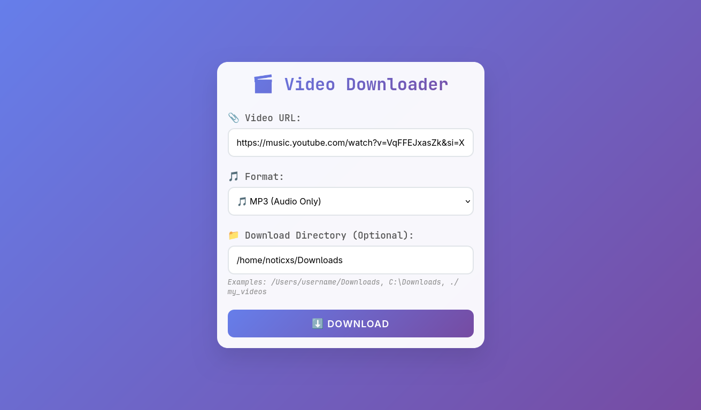

# 🎬 Video Downloader

A beautiful, modern web-based video downloader built with Flask and yt-dlp. Download videos from YouTube and other platforms in MP4 or MP3 format with real-time progress tracking and a sleek user interface.

  

## ✨ Features

- 🎥 **Multiple Format Support**: Download as MP4 (video) or MP3 (audio only)
- 📁 **Custom Download Paths**: Choose where to save your downloads
- 📊 **Real-time Progress Tracking**: See detailed download progress with smooth animations
- 📱 **Responsive Design**: Beautiful, modern UI that works on desktop and mobile
- 🎵 **Playlist Support**: Download entire playlists with per-video progress tracking
- 🔒 **Security Features**: Path traversal protection and input validation
- ⚡ **High Performance**: Multi-threaded downloads with automatic cleanup
- 🛡️ **Error Handling**: Graceful error handling with user-friendly messages

## 🖼️ Screenshots


### Main Interface
- Clean, modern design with gradient backgrounds
- Intuitive form with URL input, format selection, and custom path options
- Responsive layout that adapts to any screen size

### Progress Tracking
- Real-time progress bars with smooth animations
- Detailed status messages showing current activity
- Multi-stage progress for playlists (Item X of Y)
- Beautiful modal popup with loading animations

## 🚀 Installation

### Prerequisites

- Python 3.7 or higher
- FFmpeg (for audio conversion)

### Step 1: Clone the Repository

```bash
git clone https://github.com/yourusername/video-downloader.git
cd video-downloader
```

### Step 2: Install Python Dependencies

```bash
pip install flask yt-dlp
```

### Step 3: Install FFmpeg

#### Windows:
1. Download FFmpeg from [https://ffmpeg.org/download.html](https://ffmpeg.org/download.html)
2. Extract and add to your system PATH

#### macOS:
```bash
brew install ffmpeg
```

#### Linux (Ubuntu/Debian):
```bash
sudo apt update
sudo apt install ffmpeg
```

### Step 4: Run the Application

```bash
python server.py
```

The application will start on `http://localhost:2070`

## 📖 Usage

### Basic Download
1. Open your browser and go to `http://localhost:2070`
2. Paste a video URL in the input field
3. Select your preferred format (MP4 or MP3)
4. Click "Download"

### Custom Download Directory
1. Enter a custom path in the "Download Directory" field
2. Examples:
   - `./my_videos` (relative path)
   - `/Users/username/Downloads` (macOS/Linux absolute path)
   - `C:\Downloads` (Windows absolute path)
3. Leave empty to use the default `./music` directory

### Supported Platforms
- YouTube (videos and playlists)
- Many other platforms supported by yt-dlp
- See [yt-dlp supported sites](https://github.com/yt-dlp/yt-dlp/blob/master/supportedsites.md)

## 🛠️ API Endpoints

### POST `/download`
Start a download with the specified parameters.

**Request Body:**
```json
{
  "url": "https://youtube.com/watch?v=...",
  "format": "mp4",
  "download_id": "unique_id",
  "custom_path": "/path/to/downloads"
}
```

**Response:**
```json
{
  "status": "started",
  "download_id": "unique_id"
}
```

### GET `/progress`
Check the progress of a download.

**Parameters:**
- `download_id`: The unique identifier for the download

**Response:**
```json
{
  "status": "downloading",
  "progress": 45.2,
  "message": "Downloading: Video Title",
  "current_item": 1,
  "total_items": 1,
  "item_name": "Video Title"
}
```

## ⚙️ Configuration

### Download Options
The application uses the following yt-dlp configuration:

- **Video Format**: Best quality MP4 with audio
- **Audio Format**: 192kbps MP3 when audio-only is selected
- **File Naming**: `%(title)s.%(ext)s`
- **Error Handling**: Continue on errors, skip unavailable videos

### Security Features
- Path traversal attack prevention
- Input validation and sanitization
- Write permission verification
- Automatic memory cleanup

## 🔧 Customization

### Changing the Port
Edit the last line in `app.py`:
```python
app.run(port=YOUR_PORT)
```

### Modifying Download Options
Edit the `ydl_opts` dictionary in the `download_file` function:
```python
ydl_opts = {
    'format': 'your_preferred_format',
    'outtmpl': 'your_naming_pattern',
    # ... other options
}
```

### Styling
The CSS is embedded in the HTML template. Look for the `<style>` section in the `index()` function to modify the appearance.

## 🐛 Troubleshooting

### Common Issues

#### "FFmpeg not found"
- Ensure FFmpeg is installed and in your system PATH
- Restart your terminal/command prompt after installation

#### "Permission denied" when downloading
- Check that you have write permissions to the specified directory
- Try running with administrator/sudo privileges if needed

#### "Video unavailable"
- The video might be private, deleted, or region-locked
- Try a different video URL

#### Downloads are slow
- This depends on your internet connection and the video platform's servers
- Large playlists will take longer to process

### Debug Mode
Enable debug mode for detailed error messages:
```python
app.run(port=2070, debug=True)
```

## 🤝 Contributing

Contributions are welcome! Please feel free to submit a Pull Request. For major changes, please open an issue first to discuss what you would like to change.

### Development Setup
1. Fork the repository
2. Create your feature branch (`git checkout -b feature/AmazingFeature`)
3. Commit your changes (`git commit -m 'Add some AmazingFeature'`)
4. Push to the branch (`git push origin feature/AmazingFeature`)
5. Open a Pull Request

## 📝 License

This project is licensed under the MIT License - see the [LICENSE](LICENSE) file for details.

## ⚠️ Legal Notice

This tool is for educational and personal use only. Please respect copyright laws and the terms of service of the platforms you're downloading from. The developers are not responsible for any misuse of this software.

## 🙏 Acknowledgments

- [yt-dlp](https://github.com/yt-dlp/yt-dlp) - The powerful video downloading library
- [Flask](https://flask.palletsprojects.com/) - The web framework
- [FFmpeg](https://ffmpeg.org/) - Media processing toolkit

## 📊 Project Stats

- **Language**: Python
- **Framework**: Flask
- **Frontend**: HTML5, CSS3, Vanilla JavaScript
- **Dependencies**: yt-dlp, Flask
- **License**: MIT
- **Status**: Active Development

---

Made with ❤️ for the community. If you find this useful, please give it a ⭐!